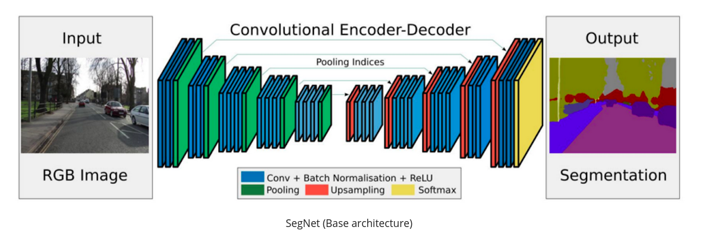
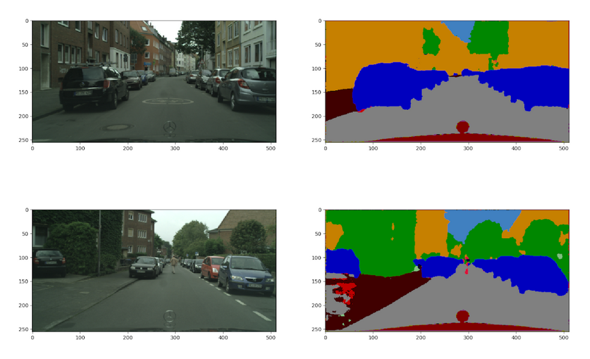
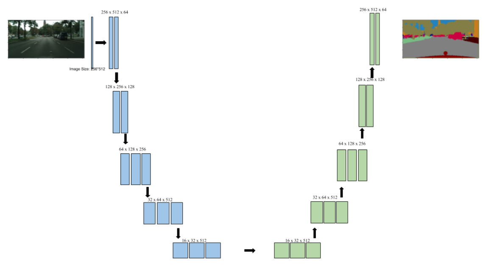
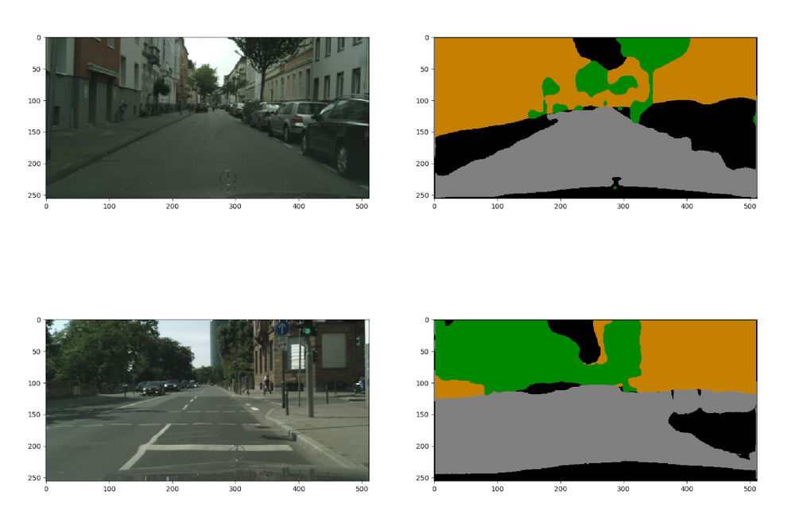
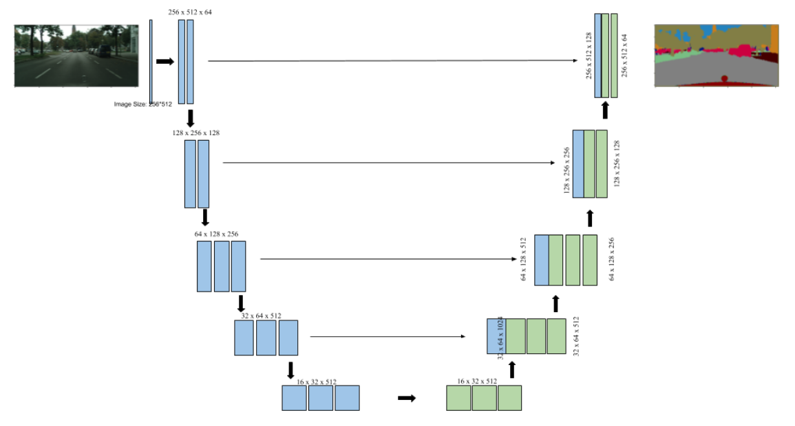
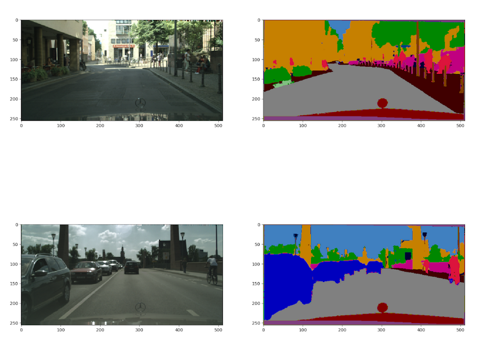
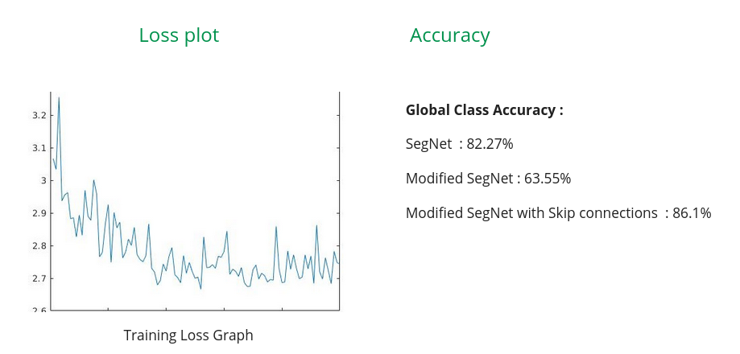

# Semantic Segmentation

This project aims to perform semantic segmentation on input images from a monocular camera using encoder-decoder architectures. <br />

Dataset : [Cityscapes](https://www.cityscapes-dataset.com/) <br />
[Project Website](https://sites.google.com/view/semseg/home) <br />

Three different architectures have been used : 
1. SegNet <br />
This is the base architecture of the project with 13 convolutional layers in encoder block & 13 transpose convolutional layers in the decoder block. <br />
Model : 

Results : 


2. Modified SegNet <br />
A variant of SegNet with no max-pooling layers. It also uses stride 2 convolution instead of stride 1 convolution. <br />
Model : 

Results : 


3. Modified SegNet with Skip connections <br />
A variant of ```Modified SegNet``` with skip connections between corresponding encoder & decoder layers  <br />
Model : 

Results : 

Loss Plot & Accuracy


## Requirements:
```
Pytorch 1.3.1
Matplotlib 3.0.3
Torchvision 0.4.2
Python 3.5.2
```

## Usage

1) Download the Cityscapes dataset and change ```DATA_PATH``` variable in main.py
2) Choose the architecture that you want to perform training/testing in the main fucntion.
3) Run main.py
